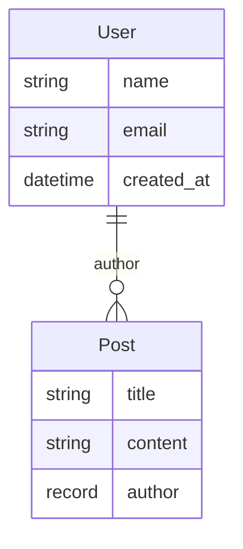

# UnrealORM CLI

Command-line interface for UnrealORM - a TypeScript ORM for SurrealDB.

## Quick Start

The fastest way to get started with UnrealORM:

```bash
# Using bunx (recommended)
bunx @unreal-orm/cli init

# Or with other package managers
npx @unreal-orm/cli init
pnpm dlx @unreal-orm/cli init
yarn dlx @unreal-orm/cli init
```

This interactive command will:

- Configure your database connection
- Set up the project structure (`unreal/` folder)
- Install dependencies (`unreal-orm`, `surrealdb`, `@unreal-orm/cli`)
- Optionally generate sample tables or import from existing database

## Installation

After running `init`, the CLI is installed as a dev dependency. You can then use it via:

```bash
# Using package.json scripts (recommended)
bun unreal pull
npm run unreal pull

# Or directly
bunx unreal pull
npx unreal pull
```

For global installation (optional):

```bash
npm install -g @unreal-orm/cli
```

## Commands

### `init`

Initialize a new UnrealORM project with configuration.

```bash
unreal init [options]

Options:
  --url <url>                  Database URL (e.g., http://localhost:8000)
  -u, --username <username>    Database username
  -p, --password <password>    Database password
  -n, --namespace <namespace>  Database namespace
  -d, --database <database>    Database name
  --auth-level <level>         Auth level: root, namespace, or database
  --embedded <mode>            Use embedded mode (memory or file path)
  --skip-install               Skip dependency installation
```

**Interactive prompts:**

- Connection details (if not provided via flags)
- Dependency installation confirmation
- Next action selection (create sample schema, pull from database, or skip)

**Generated files:**

- `unreal.config.json` - Connection and schema configuration
- `surreal.ts` - Database connection module
- Sample schema files (optional)

### `pull`

Introspect a SurrealDB database and generate TypeScript schema files.

```bash
unreal pull [options]

Options:
  --url <url>                  Database URL (e.g., http://localhost:8000)
  -u, --username <username>    Database username
  -p, --password <password>    Database password
  -n, --namespace <namespace>  Database namespace
  -d, --database <database>    Database name
  -s, --schema-dir <path>      Schema directory path
  --auth-level <level>         Auth level: root, namespace, or database
  --embedded <mode>            Use embedded mode (memory or file path)
  -y, --yes                    Skip confirmation prompts
```

**Features:**

- Introspects database schema via `INFO FOR DB` and `INFO FOR TABLE`
- Generates TypeScript model classes using UnrealORM syntax
- **Smart merge**: Preserves user customizations (comments, custom methods)
- Adds new fields/indexes with `// Added from database` comments
- Comments out removed fields/indexes for review

**Example output:**

```typescript
// User.ts
import { Table, Field, Index } from "unreal-orm";
import { surql } from "surrealdb";

export class User extends Table.normal({
  name: "user",
  schemafull: true,
  fields: {
    name: Field.string(),
    email: Field.string(),
    age: Field.int({ default: surql`18` }),
    created: Field.datetime({ value: surql`time::now()` }),
  },
}) {}

export const idx_user_email = Index.define(() => User, {
  name: "idx_user_email",
  fields: ["email"],
  unique: true,
});

export const UserDefinitions = [User, idx_user_email];
```

### `push`

Apply TypeScript schema changes to the database.

```bash
unreal push [options]

Options:
  --url <url>                  Database URL (e.g., http://localhost:8000)
  -u, --username <username>    Database username
  -p, --password <password>    Database password
  -n, --namespace <namespace>  Database namespace
  -d, --database <database>    Database name
  -s, --schema-dir <path>      Schema directory path
  --auth-level <level>         Auth level: root, namespace, or database
  --embedded <mode>            Use embedded mode (memory or file path)
  -y, --yes                    Skip confirmation prompts
```

**Features:**

- Compares code schema with database schema
- Shows detailed change preview before applying
- Generates and executes SurrealQL migrations
- Uses `OVERWRITE` keyword for safe modifications
- Supports table creation with all fields and indexes

### `diff`

Compare TypeScript schema with database schema.

```bash
unreal diff [options]

Options:
  --url <url>                  Database URL (e.g., http://localhost:8000)
  -u, --username <username>    Database username
  -p, --password <password>    Database password
  -n, --namespace <namespace>  Database namespace
  -d, --database <database>    Database name
  -s, --schema-dir <path>      Schema directory path
  --auth-level <level>         Auth level: root, namespace, or database
  --embedded <mode>            Use embedded mode (memory or file path)
  --detailed                   Show detailed field-level changes
```

**Features:**

- Semantic AST-based comparison (ignores formatting differences)
- Detects added, removed, and modified tables/fields/indexes
- Shows field-level details with `--detailed` flag

### `mermaid`

Generate Mermaid ERD diagrams from your schema.

```bash
unreal mermaid [options]

Options:
  --source <source>            Schema source: code, database, or .surql file
  -o, --output <path>          Output file path
  --stdout                     Output to stdout instead of file
  --url <url>                  Database URL (for database source)
  -s, --schema-dir <path>      Schema directory (for code source)
```

**Example output:**



## Configuration

The CLI uses `unreal.config.json` for persistent configuration:

```json
{
  "schemaDir": "./unreal/tables"
}
```

Connection details are stored in `surreal.ts`:

```typescript
import Surreal from "surrealdb";

const db = new Surreal();

await db.connect("http://localhost:8000");
await db.signin({ username: "root", password: "root" });
await db.use({ namespace: "test", database: "test" });

export default db;
```

## Connection Modes

### Remote Connection

```bash
unreal push --url http://localhost:8000 -u root -p root -n test -d test
```

### Embedded Mode (Memory)

```bash
unreal push --embedded memory -n test -d test
```

### Embedded Mode (File)

```bash
unreal push --embedded ./data/surreal.db -n test -d test
```

### Full Automation

```bash
unreal push \
  --url ws://localhost:8000 \
  -u root -p secret \
  -n production -d myapp \
  --auth-level root \
  -s ./unreal/tables \
  -y
```

## Supported SurrealDB Features

### Tables

- ✅ Normal tables
- ✅ Relation tables
- ✅ View tables
- ✅ Schemafull/schemaless
- ✅ Permissions

### Fields

- ✅ All primitive types (string, int, float, bool, datetime, etc.)
- ✅ Complex types (array, set, object, record)
- ✅ Optional types (option<T>)
- ✅ Default values
- ✅ Value expressions
- ✅ Assertions
- ✅ Permissions

### Indexes

- ✅ Standard indexes
- ✅ Unique indexes
- ✅ Multi-column indexes
- ⏳ Search indexes (parsed, not fully generated)

### Events

- ⏳ Changefeeds (planned)

## Development

```bash
# Install dependencies
bun install

# Build
bun run build

# Run tests
bun test

# Link for local testing
bun link

# Test the CLI
unreal --help
```

## License

ISC
